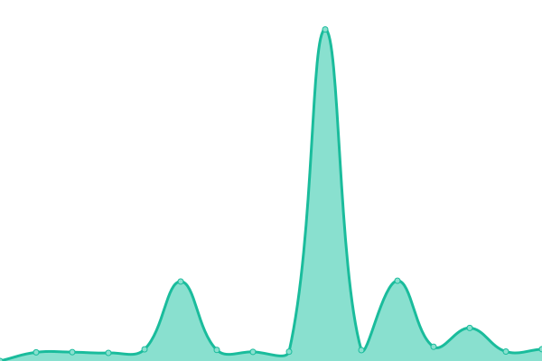

# [📈 Live Status](https://mtstatus.voxelmanip.se): <!--live status--> **🟨 Degraded performance**

This repository contains the open-source uptime monitor and status page for [ROllerozxa](https://voxelmanip.se), powered by [Upptime](https://github.com/upptime/upptime).

With [Upptime](https://upptime.js.org), you can get your own unlimited and free uptime monitor and status page, powered entirely by a GitHub repository. We use [Issues](https://github.com/rollerozxa/mt-uptime-status/issues) as incident reports, [Actions](https://github.com/rollerozxa/mt-uptime-status/actions) as uptime monitors, and [Pages](https://mtstatus.voxelmanip.se) for the status page.

<!--start: status pages-->
<!-- This summary is generated by Upptime (https://github.com/upptime/upptime) -->
<!-- Do not edit this manually, your changes will be overwritten -->
<!-- prettier-ignore -->
| URL | Status | History | Response Time | Uptime |
| --- | ------ | ------- | ------------- | ------ |
|  [minetest.net](https://www.minetest.net) | 🟩 Up | [minetest-net.yml](https://github.com/rollerozxa-org/mt-uptime-status/commits/HEAD/history/minetest-net.yml) | 

 568ms
     
 | 

<a href="https://mtstatus.voxelmanip.se/history/minetest-net">100.00%</a>
    

|  [content.minetest.net](https://content.minetest.net) | 🟩 Up | [content-minetest-net.yml](https://github.com/rollerozxa-org/mt-uptime-status/commits/HEAD/history/content-minetest-net.yml) | 

 1664ms
     
 | 

<a href="https://mtstatus.voxelmanip.se/history/content-minetest-net">100.00%</a>
    

|  [forum.minetest.net](https://forum.minetest.net) | 🟨 Degraded | [forum-minetest-net.yml](https://github.com/rollerozxa-org/mt-uptime-status/commits/HEAD/history/forum-minetest-net.yml) | 

 5715ms
     
 | 

<a href="https://mtstatus.voxelmanip.se/history/forum-minetest-net">80.64%</a>
    

|  [servers.minetest.net](https://servers.minetest.net) | 🟩 Up | [servers-minetest-net.yml](https://github.com/rollerozxa-org/mt-uptime-status/commits/HEAD/history/servers-minetest-net.yml) | 

 555ms
     
 | 

<a href="https://mtstatus.voxelmanip.se/history/servers-minetest-net">100.00%</a>
    

|  [wiki.minetest.net](https://wiki.minetest.net/Main_Page) | 🟨 Degraded | [wiki-minetest-net.yml](https://github.com/rollerozxa-org/mt-uptime-status/commits/HEAD/history/wiki-minetest-net.yml) | 

 6566ms
     
 | 

<a href="https://mtstatus.voxelmanip.se/history/wiki-minetest-net">60.43%</a>
    

|  [dev.minetest.net](https://dev.minetest.net/Main_Page) | 🟩 Up | [dev-minetest-net.yml](https://github.com/rollerozxa-org/mt-uptime-status/commits/HEAD/history/dev-minetest-net.yml) | 

 6249ms
     
 | 

<a href="https://mtstatus.voxelmanip.se/history/dev-minetest-net">99.42%</a>
    

<!--end: status pages-->

[**Visit our status website →**](https://mtstatus.voxelmanip.se)

## 📄 License

- Powered by: [Upptime](https://github.com/upptime/upptime)
- Code: [MIT](./LICENSE) © [ROllerozxa](https://voxelmanip.se)
- Data in the `./history` directory: [Open Database License](https://opendatacommons.org/licenses/odbl/1-0/)
